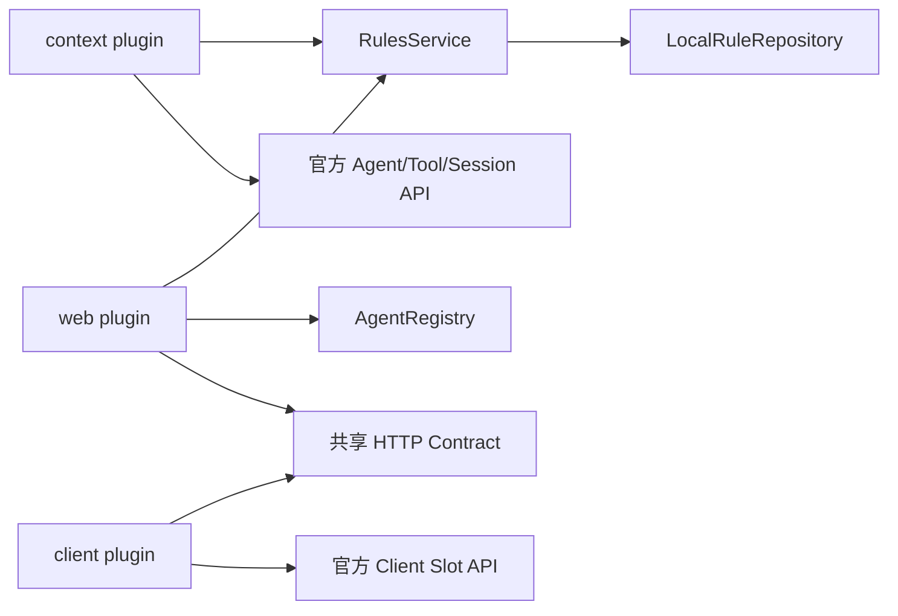

# DSH Rules 0.2.0 架构重写计划

## Summary

将 `/Users/bytedance/dsh/dsh-rules` 重写为基于 DeepSeek Harness 0.1.0-rc.6 公开插件接口的 Rules 插件，不沿用当前手写 Harness 类型、混合式 HTTP/UI 文件和自研生命周期近似实现。

重写保留以下产品能力：

- 全局规则：`${DSH_HOME:-~/.dsh}/rules/**/*.md`
- 项目规则：`<workspace>/.dsh/rules/**/*.md`
- Always、File Glob、Intelligent、Manual 四种模式
- File Glob 与 Intelligent 渐进式披露
- `rule` 工具按需加载规则正文
- `@file` 引用
- 全局/项目规则列表、创建、编辑、删除、刷新和分页
- 当前设置页布局、亮暗色和“编辑器在上、已有规则在下”的交互

明确改变：

- 版本升级为 `0.2.0`
- 删除 URL 导入功能及全部网络抓取/SSRF 代码
- 不读取旧版 Session Log 中 `source.kind === "plugin" && plugin === "rules"` 的 catalog 状态
- 现有 `.md` 规则文件格式保持兼容
- 创建规则必须填写显式相对路径，支持嵌套路径；编辑时路径不可修改
- 创建同名规则返回冲突，不再静默覆盖
- 项目规则明确仅支持 Host 可见的本地 workspace，以保证完整 CRUD
- 目标运行时固定为本机当前 `dsh 0.1.0-rc.6`

## Goals And Success Criteria

### Goal

使插件满足以下工程属性：

1. 直接使用 Harness/Cordis 官方类型、服务和生命周期。
2. 模型上下文、Web API 和 UI 共享一个规则领域与仓储真源。
3. 所有跨 wire 输入严格解析，字段缺失不注入默认业务值。
4. 所有模型可见输出执行完整 UTF-8 字节预算。
5. 创建、更新和删除具备明确的冲突与并发语义。
6. Headless 模型能力不依赖 Web UI。
7. 真实 Loader、Agent Loop、Session Log 和 Web UI 均有验收覆盖。

### Acceptance Criteria

- `pnpm check` 完成类型检查、单元/集成测试和构建。
- 真实 Loader smoke 能加载服务、context 和 web 三个插件入口。
- keyless Agent Loop 测试能在真实 Session Log 中观察到规则上下文。
- Playwright 通过真实 `dsh web` 创建、编辑、删除全局和项目规则。
- `maxContextBytes: 1` 时，任何规则注入和 `rule` 工具结果均不超过 1 个 UTF-8 字节。
- IPv4/IPv6 URL 不再进入任何代码路径，因为 URL 导入已删除。
- 两个并发 create 不会互删临时文件；同名 create 只有一个成功。
- stale update/delete 返回 409，且不修改文件。
- Client 收到缺字段 2xx 响应时进入 error 状态，不清空为 `[]`/`""`，不关闭草稿。
- 插件 fiber/Client HMR 卸载后，工具、route、slot、listener 和 style 均被清理。
- `pnpm pack` 产物包含 Host、Client、声明文件、patch、README、LICENSE 和设计文档。
- 从 GitHub 安装时 `prepare` 能在没有现成 `lib/` 的源码包中生成运行产物。

## Audience

- 使用 DSH Web 管理 Cursor 风格规则的终端用户。
- 维护 `dsh-rules` 的插件开发者。
- 在普通 DSH Web 与 DSH Desktop 中组合该插件的 profile 作者。

## In Scope

- 整体源代码目录重组。
- Host Rules service、context consumer、Web API consumer。
- Client 设置页数据层和组件层重写。
- 构建、包 manifest、bundle patch 和发布流程。
- 全部测试重组。
- README、设计文档和审计文档更新。

## Out Of Scope

- Team Rules。
- URL 导入。
- 旧 Session Log source 兼容。
- 项目规则的远程/E2B/替代 `ctx.fs` CRUD。
- Typert Remote/API Remotes 接入。
- 设置页视觉重设计。
- 规则路径重命名。
- 修改 `deepseek-harness` 或 `deepseek-harness-desktop`。

## Current State Analysis

### Current Structure

```text
src/
├── index.ts       # 手写 Harness 类型、工具、上下文、恢复、Web route 装配
├── http.ts        # CRUD、HTTP、Host/Origin、URL 导入、SSRF、原子写
├── rules.ts       # 类型、解析、发现、glob、manual、引用、路径、序列化
├── client.tsx     # CSS、fetch、状态、编辑器、列表、slot 注册
└── lucide-icons.d.ts
```

四个主文件约 1850 行，职责边界与 Harness 官方分层不一致。

### Confirmed Defects

1. IPv4-mapped IPv6 十六进制形式绕过 URL 导入 SSRF 检查。
2. 新建/导入同名规则静默覆盖已有文件。
3. `${path}.${pid}.${Date.now()}.tmp` 在同毫秒并发写时互相删除。
4. `maxContextBytes` 不覆盖 Manual、Catalog、wrapper 和 `rule` 工具结果。
5. Client 列表请求没有 latest-wins，旧 scope 可覆盖新 scope。
6. Client 将缺失 `rules`/`directory` 降级为 `[]`/`""`，mutation 不校验 `ok`。
7. Host/Client 手写官方接口，Harness API 变化无法触发类型错误。
8. 只有 TypeScript `Config` interface，没有 Schemastery 运行时 schema。
9. 模型行为测试使用自制假 Harness；真实 E2E 只覆盖 UI 和文件落盘。
10. style 注入无 disposer，Client HMR 后可能保留旧样式。

### Reference Patterns

主要参考：

- `deepseek-harness/packages/context/agent-instructions`
  - 官方 Agent/Session/Tool 类型
  - `agent/pre-step` 与 `tools/result`
  - nested tool execution token 归并
  - Session Log 中结构化 source
  - 完整消息字节预算
- `deepseek-harness/packages/skill/tool-skill`
  - `defineTool`
  - 渐进式 catalog
  - 精确工具可见性
  - catalog replacement 与恢复
- `deepseek-harness/packages/client/ui-settings-models`
  - `ClientContext`
  - `PropsRuntime`/`InjectFace`
  - `createSnapshotStore`
  - generation-based latest-load-wins
  - 组件、store、apply 分离
- `deepseek-harness/packages/util/atomic-write`
  - 随机临时文件
  - 原子替换
  - writer lock
- `deepseek-harness-desktop/dsh-plugin-desktop`
  - Host/Client 独立入口
  - 共享 contract 文件
  - Schemastery Config
  - route 输入严格解析
  - 所有副作用归属 Cordis generation
  - style installer 返回 disposer
  - 构建和 Loader/profile smoke

## Architecture

### Package Composition

一个 npm 包提供三个 Host 插件入口和一个 Client 入口：

```text
dsh-rules                 RulesService provider
dsh-rules/context         模型上下文与 rule 工具 consumer
dsh-rules/web             loopback 管理 API consumer
dsh-rules/client          Web 设置页
```

`cordis.patch.yml` 插入三行：

```yaml
- insert:
    - id: rules-service
      name: dsh-rules
      config:
        maxContextBytes: 65536
        maxRuleBytes: 262144
        maxReferenceBytes: 262144
        catalogDescriptionMaxLength: 500
    - id: rules-context
      name: dsh-rules/context
    - id: rules-web
      name: dsh-rules/web
```

依赖关系：



这样：

- Headless profile 中 `rules-service` 与 `rules-context` 可工作。
- 没有 `webServer` 时只有 `rules-web` 保持 PENDING。
- Context 和 Web API 共享同一个 service、配置和仓储。
- Client 不接触 Host 私有对象。

### Why Not Typert Remote

本次不接入 Typert Remote：

- Remote contribution 需要 Host 构建期生成 `/remote` 产物。
- Client 应用的 `api-remotes` 需要显式选择并挂载贡献。
- 独立插件无法要求现有 Web App 修改其 BFF assembly。
- Desktop 的窄 Host/Client 通信同样使用严格 loopback route + shared contract。

因此保留自有 route，但必须做到：

- 只注册在 loopback Web Server。
- Host/Origin 与启动时权威地址精确匹配。
- mutation 要求 `application/json`。
- 请求和响应都由共享 contract 严格解析。
- route 随 fiber 卸载。

## Proposed File Structure

```text
src/
├── index.ts                    # RulesService 默认导出
├── context.ts                  # context consumer 插件入口
├── web.ts                      # Web API consumer 插件入口
├── config.ts                   # Config interface + Schemastery schema
├── types.ts                    # 纯类型：RuleId、RuleRecord、RuleMode 等
├── contract.ts                 # HTTP 请求/响应联合、严格解析、错误码
├── domain/
│   ├── parser.ts               # frontmatter、模式判定、序列化
│   ├── matcher.ts              # glob、manual 引用、别名歧义
│   ├── references.ts           # @file 发现与安全展开
│   └── renderer.ts             # Always/Catalog/Manual/tool 完整预算
├── host/
│   ├── repository.ts           # 本地全局/项目规则仓储
│   ├── context-controller.ts   # per-Agent disclosure/touch/digest 状态
│   └── http-handler.ts         # route method、origin、payload、response
└── client/
    ├── index.ts                # Client apply 与 settings.section 注册
    ├── api.ts                  # strict fetch adapter
    ├── store.ts                # RulesPageController + SnapshotStore
    ├── RulesSection.tsx        # 页面编排
    ├── RuleEditor.tsx          # structured/raw repair editor
    └── styles.ts               # 自包含 CSS + installer disposer
```

删除：

- `src/client.tsx`
- `src/http.ts`
- `src/rules.ts`
- `src/lucide-icons.d.ts`

## Domain Model

### Types

`src/types.ts` 只放类型，不放运行时代码：

```ts
type RuleScope = 'global' | 'project'
type RuleMode = 'always' | 'file' | 'intelligent' | 'manual'
type RuleParseState = 'valid' | 'invalid'
type RuleId = Branded<'RuleId'>
type RuleRevision = Branded<'RuleRevision'>

interface RuleRecord {
  id: RuleId
  scope: RuleScope
  relativePath: string
  mode: RuleMode | 'invalid'
  description: string
  globs: readonly string[]
  body: string
  rawContent: string
  revision: RuleRevision
  parseError?: string
}
```

`RuleId` 格式保持：

```text
global:<relative-path>.md
project:<relative-path>.md
```

### Rule Paths

创建 UI 使用显式“规则路径”字段：

- 接受 `frontend/react` 或 `frontend/react.md`
- 规范化为 `frontend/react.md`
- 支持嵌套路径
- 每个 segment 仅允许字母、数字、点、下划线和连字符
- 禁止空 segment、`.`、`..`、绝对路径、反斜杠、NUL
- 编辑时路径不可变
- create 遇到已有路径返回 `409 rule-conflict`

### Parsing

保留现有 frontmatter：

```yaml
---
description: React 组件约束
globs:
  - "src/**/*.tsx"
alwaysApply: false
---
```

模式优先级保持：

1. `alwaysApply: true` → Always
2. `globs` 非空 → File Glob
3. `description` 非空 → Intelligent
4. 其余 → Manual

`invalid` 文件仍出现在列表：

- 列表显示 `parseError`
- 编辑器切换到 raw repair 模式，显示完整 `rawContent`
- raw 保存前必须重新解析为有效规则
- 禁止把 invalid 文件自动转换为 body 为空的 Manual 规则

### Manual Resolution

- `@rule(global:path.md)` / `@rule(project:path.md)` 使用精确 ID。
- `@name` 只在当前优先 scope 中唯一时解析。
- 项目 scope 优先于全局 scope。
- 同一 scope 多个嵌套规则共享 basename 时视为歧义，不注入任意一条。
- `rule` 工具只接受 catalog 中披露的精确 ID，不接受别名。

### Reference Expansion

- 全局规则的 `@file` 根目录为全局 rules 目录。
- 项目规则的 `@file` 根目录为 workspace cwd。
- 禁止绝对路径、越界和符号链接逃逸。
- 单个引用受 `maxReferenceBytes` 限制。
- 完整展开仍受最终 context/tool 输出预算限制。
- 对 `</system-reminder>`、`</rule>`、`</rule_reference>` 等 framing delimiter 做转义，规则内容不能破坏插件自有框架。

## RulesService

### Config

`src/config.ts`：

```ts
interface Config {
  dshHome?: string
  maxContextBytes: number
  maxRuleBytes: number
  maxReferenceBytes: number
  catalogDescriptionMaxLength: number
  maxRuleCount: number
}
```

Schemastery 默认值：

```text
maxContextBytes = 65536
maxRuleBytes = 262144
maxReferenceBytes = 262144
catalogDescriptionMaxLength = 500
maxRuleCount = 512
```

约束：

- 所有数值为正安全整数。
- `dshHome` 使用 `@deepseek-ai/dsh-home-paths` 解析。
- 非法配置在 Loader apply 前失败。
- 删除 `trustedHosts`。

### Service API

`RulesService` 是 Cordis Service，key 为 `rules`。根入口默认导出该 class，并将 `src/config.ts` 的 schema 作为静态配置面暴露：

```ts
export default class RulesService extends Service {
  static Config = Config

  constructor(ctx: Context, config: Config) {
    super(ctx, 'rules')
    // resolve config and construct the repository
  }
}
```

Loader 因而在 service 构造前完成默认值填充和非法配置拒绝。Service API：

```ts
interface RuleLocation {
  scope: RuleScope
  cwd?: string
}

list(location, signal): Promise<RuleRecord[]>
get(location, id, signal): Promise<RuleRecord | undefined>
create(location, relativePath, document, signal): Promise<RuleRecord>
update(location, id, expectedRevision, document, signal): Promise<RuleRecord>
remove(location, id, expectedRevision, signal): Promise<void>
expand(record, signal): Promise<ExpandedRule>
```

该 service 不读取 AgentRegistry。调用方负责把 Agent 解析成 `cwd`：

- context consumer 使用事件中的 `agent.session.header.cwd`
- web consumer 使用 `SessionId` 调 `ctx.agents.get()`，再读取权威 cwd

### Local Repository

`src/host/repository.ts` 统一实现全局和项目本地仓储：

- 全局 root：`${dshHome}/rules`
- 项目 root：`<cwd>/.dsh/rules`
- 递归稳定排序扫描 `.md`
- 最多读取 `maxRuleCount` 个规则，超限明确失败
- 每文件最多 `maxRuleBytes`
- `RuleRevision` 为原始 UTF-8 内容的 SHA-256
- 路径操作同时执行 lexical containment、逐级 `lstat` 和 realpath containment
- 拒绝规则 root 内的符号链接目录和符号链接文件

写入：

- 使用 `@deepseek-ai/dsh-atomic-write`
- rules 目录权限 `0700`
- 规则文件权限 `0600`
- create 在 writer lock 内确认不存在
- update 在 writer lock 内重新读取并校验 revision
- delete 在 writer lock 内重新读取并校验 revision
- conflict/stale 不改变文件
- nested parent 在校验无 symlink 后创建

项目规则在 0.2.0 明确是 Host-local 能力。README 记录：E2B/远程 `ctx.fs` execution world 不保证项目规则 CRUD。

## Model Context Consumer

### Official APIs

`src/context.ts` 直接使用：

- `Context` from `@deepseek-ai/cordis`
- `Agent`、`PreStepDecision` from `@deepseek-ai/dsh-agent`
- `defineTool`、`ToolExecution`、`ToolExecutionResult`、`ToolExecutionToken` from `@deepseek-ai/dsh-tools`
- `createUserMessage` from `@deepseek-ai/dsh-llm`
- `UserMessage`、`SessionId` from `@deepseek-ai/dsh-session`

插件：

```ts
export const name = 'rules-context'
export const inject = ['rules', 'agents', 'tools']
```

不再声明任何近似 Harness interface。

### Message Sources

通过 declaration merging 注册三个 source：

```text
rules-always       complete Always replacement
rules-catalog      complete progressive catalog replacement
rules-manual       direct user invocation
```

source 保存：

- `form`
- `digest`
- 实际被渲染的 entries
- omitted/truncated 统计
- replacement 标记

新实现只识别以上 source；旧 `plugin/rules` source 不读取。

### File Touches

参考 `agent-instructions`：

- 监听成功且未 abort 的 `read`、`write`、`edit`
- 使用 `ToolExecutionToken` 和 `parent` 归并 nested Code Mode 调用
- 只有根 execution 成功提交后才公开触达路径
- per-Agent queue 保证触达按顺序消费
- plugin dispose 时 abort 未完成投影并清空 map

保留直接用户消息中反引号文件路径的 File Glob 触发。

### Progressive Catalog

- Intelligent 规则默认进入 eligible catalog。
- File Glob 规则仅在触达路径命中后进入 eligible catalog。
- Catalog 只包含 ID、mode、bounded description/globs。
- 只有最终 renderer 实际放入 catalog 的 ID 才加入 `rule` 工具可读集合。
- Catalog digest 从结构化 entries 计算，不从模型 prose 反解析。
- 当前 decision 已有旧 catalog 时原位替换；visible history digest 相同则不重发。
- 文件删除或模式变化发布完整 replacement catalog。

### `rule` Tool

使用 `defineTool`：

```ts
parameters: {
  id: { type: 'string', required: true }
}
```

规范返回值：

```ts
{
  id: RuleId
  scope: RuleScope
  mode: 'file' | 'intelligent'
  content: string
  truncated: boolean
  omittedBytes: number
}
```

- 只读取当前 Agent 已披露的精确 ID。
- 执行时重新从 RulesService 读取，文件仍是真源。
- 删除、变成 invalid 或不再披露的规则拒绝加载。
- 结果完整文本受 `maxContextBytes` 限制。
- `presentCall` 保持 generic/read 卡片。
- `output.render` 只呈现 bounded content。

### Complete Budget

`src/domain/renderer.ts` 在完整 wrapper 已知的位置执行 UTF-8 预算。

同一 pre-step 新增的所有 rules 消息共享一个 `maxContextBytes`：

优先级：

1. 用户显式 Manual，按引用顺序
2. 项目 Always
3. 全局 Always
4. 项目 Catalog
5. 全局 Catalog

算法：

1. 先构造每个候选的完整 framed section。
2. 计算固定 wrapper 和最终 omission marker。
3. 按优先级完整放入候选。
4. 第一个无法完整放入的候选按 UTF-8 边界截断。
5. 低优先级候选全部省略。
6. 输出 bounded marker，包含 truncated rule ID、原始/保留字节与 omitted count。
7. 极小预算下 marker 本身也按 UTF-8 截断。
8. 最终断言所有新增消息 UTF-8 总和 `<= maxContextBytes`。

模型显示顺序仍为：

1. 全局 Always
2. 项目 Always
3. Catalog
4. Manual

预算优先级和显示顺序分离。

## Web API

### Route

固定 route：

```text
/dsh-rules/api
```

`src/web.ts`：

```ts
export const name = 'rules-web'
export const inject = ['rules', 'agents', 'webServer']
```

加载时：

- `ctx.webServer.host` 必须是 loopback。
- 从 `host + port` 构造唯一 expected Host/Origin。
- route 通过 `ctx.effect` 注册。

### Target

浏览器不再发送 cwd。

```ts
type RuleTarget =
  | { scope: 'global' }
  | { scope: 'project'; sessionId: SessionId }
```

Web consumer：

1. 将 wire string 转为 `SessionId`。
2. 使用 `ctx.agents.get(sessionId)`。
3. 要求 Agent live 且有 cwd。
4. 将权威 cwd 传给 RulesService。

### Requests

List：

```text
GET /dsh-rules/api?scope=global
GET /dsh-rules/api?scope=project&sessionId=<id>
```

Mutation：

```ts
POST /dsh-rules/api

type MutationRequest =
  | {
      action: 'create'
      target: RuleTarget
      relativePath: string
      document: StructuredRuleDocument
    }
  | {
      action: 'update'
      target: RuleTarget
      id: RuleId
      expectedRevision: RuleRevision
      document: StructuredRuleDocument | RawRepairDocument
    }
```

Delete：

```text
DELETE /dsh-rules/api?scope=...&sessionId=...&id=...&expectedRevision=...
```

### Responses

共享 discriminated union：

```ts
type ApiSuccess<T> = { ok: true; value: T }
type ApiFailure = {
  ok: false
  error: {
    code:
      | 'invalid-request'
      | 'forbidden'
      | 'inactive-session'
      | 'not-found'
      | 'rule-conflict'
      | 'stale-rule'
      | 'invalid-rule'
      | 'internal'
    message: string
  }
}
```

HTTP 状态：

- 200：list/update
- 201：create
- 204：delete
- 400：invalid request/invalid rule
- 403：Host/Origin/Content-Type
- 404：inactive session/not found
- 409：name conflict/stale revision
- 500：internal

Client 对 response 逐字段严格解析：

- 缺失 `ok`、`value`、`error.code`、`rules`、`directory`、rule fields 均抛 contract error。
- 不使用 `[]`、`""` 或默认成功文本掩盖后端字段缺失。
- UI 自有空态文案仍可保留。

### Request Security

- 所有请求校验 exact Host。
- Mutation 校验 exact Origin。
- POST 要求 `application/json`，否则 415。
- 请求体总字节上限由 `maxRuleBytes + 固定协议开销` 得出。
- IncomingMessage close/aborted 传播到 operation AbortSignal。
- 删除 URL import 后不存在出站网络请求。

## Client

### Official Client Contracts

使用：

- `ClientContext`
- `PropsRuntime<'settings.section'>`
- `InjectFace`
- `SnapshotStore` / `createSnapshotStore`
- `bindSnapshotSelector`
- `@deepseek-ai/dsh-client-ui-primitives`

移除：

- 手写 `SessionListState`
- 手写 slots API
- `lucide-react`
- 未使用的 Client inject edges

### Controller

`RulesPageController` 拥有：

```ts
interface RulesPageState {
  status: 'idle' | 'loading' | 'ready' | 'error'
  error: string | null
  target: RuleTarget | null
  directory: string | null
  rules: readonly RuleView[]
  mutation: 'idle' | 'saving' | 'deleting'
}
```

- 每次 `load()` 增加 generation。
- scope/session 改变或 refresh 时取消上一请求。
- 旧 generation 永不提交状态。
- load 失败保留最后一份成功 rows，并设置 error。
- mutation 仅在 strict success 后关闭草稿并 reload。
- 409 保留草稿，展示名称冲突或 stale 提示。
- dispose abort 所有 pending request。

### Slot Registration

`src/client/index.ts`：

- 创建一个 controller。
- 将 controller store 放入 inject `hooks` compartment。
- 将 load/create/update/remove callbacks 作为 plain callbacks 注入。
- 通过 `ctx.slots.inject('settings.section', () => ctx.slots.register(...))` 注册。
- props 类型为 `PropsRuntime<'settings.section'> & InjectFace<RulesSectionInjected>`。
- style installer 由 `ctx.effect` 持有并返回 disposer。

### UI

保持当前视觉和工作流，只增加：

- 创建态“规则路径”输入。
- nested path 示例。
- create conflict 提示。
- stale update/delete 提示与刷新动作。
- invalid rule raw repair editor。

保留：

- 全局/项目 tabs
- 创建类型菜单
- 编辑器在列表上方
- 已有规则继续显示
- 分页
- 亮暗色
- 移动端约束

样式移到 `src/client/styles.ts`。保持 self-contained string bundle，但 installer 每次创建独立 style 并返回 remove disposer，和 Desktop 示例一致。

## Build And Package

### Version And Dependencies

`package.json`：

- version → `0.2.0`
- 目标 DSH → `0.1.0-rc.6`
- 官方 Harness/Cordis 包使用精确 rc.6 peer dependency，并在 devDependencies 镜像。
- `@deepseek-ai/schemastery`、`yaml`、`picomatch` 保留为运行依赖。
- 删除 `lucide-react`。
- 添加测试所需的 Agent Loop testkit、Loader smoke、Local FS、Session、LLM mock/replay 等 rc.6 dev dependencies。

### Exports

```json
{
  ".": "./lib/index.js",
  "./context": "./lib/context.js",
  "./web": "./lib/web.js",
  "./client": "./lib/client.js",
  "./contract": "./lib/contract.js",
  "./package.json": "./package.json"
}
```

删除公开 `./rules` 子路径。

### TypeScript Programs

参考 Desktop：

- `tsconfig.json`：Host/service/domain
- `tsconfig.client.json`：Client
- `tsconfig.tests.json`：Host tests
- `tsconfig.tests.client.json`：Client tests

Host 不包含 DOM/React 类型；Client 不包含 Node Host 实现。

### tsdown

从 `src` 直接打包：

- ESM：`index`、`context`、`web`、`contract`
- Browser ModuleLoader CJS：`src/client/index.ts`
- React 和官方 Client 包 external
- `yaml`/`picomatch` 按 package 策略 external 或 bundle，但结果必须通过独立安装 smoke

### GitHub Install

当前仓库不提交 `lib/`，GitHub 安装无法依赖已有产物。

新增：

- `prepare`：使用专用 `tsdown.prepare.config.ts` 从 `src` 直接生成运行 JS，不依赖项目引用或预先存在的 `lib/types`。
- `prepack`：执行完整 check + build。
- npm/tarball 继续交付预构建产物。

README 说明 pnpm 10+ 对 Git dependency `prepare` 的 allowBuilds 要求。

## Tests

### Domain Unit Tests

重写 `test/rules.test.ts` 为：

- frontmatter 和四模式优先级
- string/list globs
- manual exact/unique/ambiguous
- nested path validation
- framing delimiter escaping
- UTF-8 multibyte truncation
- exact/tiny budgets
- Manual/Project Always/Global Always/Catalog priority
- tool result budget

### Repository Tests

新增 `test/repository.test.ts`：

- recursive discovery
- max rule count
- oversized file
- nested create
- create conflict
- update revision
- stale update
- stale delete
- symlink file/parent escape
- global/project root
- concurrent create/update
- file and directory modes

### API Tests

重写 `test/http.test.ts`：

- exact Host
- exact Origin
- Content-Type 415
- body bound
- strict request union
- sessionId → live Agent → cwd
- inactive session
- create 201
- conflict/stale 409
- invalid raw repair 400
- missing file 404
- aborted request
- response contract parsers reject every missing required field
- 无 URL/import 路径

### Real Context Integration

替换 `test/plugin.test.ts` 的假 Harness：

- 使用真实 `Context`
- mount `AgentRegistry`、`ToolRuntime`、`SessionStore`、`SystemPrompt`、Local FS、Agent Loop testkit
- mount `RulesService` 与 context consumer
- 创建真实 Agent
- 断言：
  - Always 进入真实 pre-step 与 Session Log
  - Intelligent 仅发布 catalog
  - File Glob 在成功工具触达后披露
  - nested Code Mode touch 只在根调用成功后提交
  - Manual 仅由 direct user source 激活
  - `rule` tool 只读已披露 exact ID
  - compaction/surface 移除后发布 replacement
  - dispose 后工具/listener 消失

### Loader Smoke And Snapshot

新增：

```text
test/fixtures/loader/
├── cordis.yml
├── driver.ts
└── expected-session.json
```

使用 `@deepseek-ai/dsh-loader-smoke`：

- 通过真实 Loader 启动 service/context/web entries。
- 使用 deterministic mock LLM 捕获请求。
- 验证 named exports，没有 default/function plugin 混用。
- 验证模型请求中规则上下文。
- 验证持久化 Session Log 可重建。
- 产出 keyless expected snapshot。

### Client Tests

使用 jsdom + 官方 client test runtime：

- slot 注册和卸载
- style 安装/删除/HMR 替换
- load latest-wins
- abort
- strict response parsing
- create conflict 保留草稿
- stale update 保留草稿
- invalid raw repair
- project session switch
- editor/list 共存

### Playwright

保留真实 `dsh web` E2E，扩展为：

1. 安装本地插件。
2. 启动真实 rc.6 `dsh web`。
3. 创建显式命名全局规则。
4. 打开第二个 create editor，确认已有规则在下方。
5. 创建嵌套规则。
6. 同名 create 显示冲突且不覆盖。
7. 编辑并保存。
8. 删除。
9. 切换项目 scope 并创建项目规则。
10. 切换亮/暗色。
11. 检查桌面和移动 viewport 无溢出。

不使用任意 `waitForTimeout` 等待状态；改为基于可见状态和网络/DOM 条件。

### Optional Real Model

保留一个 `DEEPSEEK_API_KEY` 存在时才运行的 e2e：

- Always 指令可影响真实回复。
- File Glob + `rule` 工具可完成按需加载。
- 断言外部状态或 Session Log，不只相信模型自述。

## Documentation

### README.md

更新：

- 0.2.0 架构和三插件组成
- 显式路径创建
- 删除 URL 导入
- 本地项目 workspace 限制
- GitHub prepare/allowBuilds
- 配置 schema
- Model Experience：
  - Always 条件
  - Catalog 条件
  - Manual 条件
  - `rule` 工具
  - token/KV cache 影响
- Known Limitations

### docs/design.md

重写为 0.2.0 当前设计：

- Service/provider/consumer
- data flow
- source types
- budget
- storage transaction
- API contract
- Client controller
- lifecycle

### docs/architecture-audit.md

保留为“0.1.0 重写前审计”，在顶部标注 historical，并链接 0.2.0 design。不要把审计内容继续描述为新实现现状。

### docs/plan.md

替换旧计划，改为简短指针，链接本计划和 0.2.0 design；不保留与旧文件结构冲突的任务。

## Migration And Compatibility

- `.md` 文件位置和 frontmatter 保持不变，无文件迁移。
- 0.2.0 首次 pre-step 从文件重新发现并发布新 source。
- 不读取旧 catalog/source，不维护兼容分支。
- 旧 Session Log 仍保留历史消息；新实现只对新 source 做 replacement/digest 判断。
- 包版本升级到 0.2.0。
- route 路径保持 `/dsh-rules/api`，但 wire contract 是内部破坏性变化。
- 编辑规则必须携带 revision；旧页面 bundle 与新 Host 不兼容，Loader/HMR 必须作为一个 generation 一起更新。

## Implementation Order

1. 更新 package 依赖、版本、tsconfig 和 tsdown，建立 rc.6 官方类型基线。
2. 建立 `types.ts`、`config.ts` 和 `contract.ts`。
3. 重写 parser、matcher、references、renderer，并先完成 domain tests。
4. 实现 LocalRuleRepository 与并发/路径测试。
5. 实现 RulesService。
6. 实现 context consumer、source、`defineTool`、touch ancestry 和真实 Context tests。
7. 实现 web consumer 与严格 HTTP handler。
8. 实现 Client API、controller、组件和 style lifecycle。
9. 更新 Playwright。
10. 建立 Loader smoke/keyless snapshot。
11. 更新 README/design/audit/plan。
12. 执行完整验证和 pack/install smoke。

## Verification

执行时至少运行：

```sh
pnpm install
pnpm typecheck
pnpm test
pnpm build
pnpm test:e2e
pnpm pack
git diff --check
```

专项验证：

```sh
# 确认当前兼容目标
dsh --version

# 确认没有旧实现和 URL import
rg "requestRemote|fetchRemoteRule|trustedHosts|从 URL 导入|lucide-react" src test README.md

# 确认没有手写 Harness 核心接口
rg "interface (PluginContext|ToolDefinition|PreStepDecision|SessionListState)" src

# 确认所有注册由 effect/ctx.on/service 生命周期持有
rg "register\\(" src
```

发布验证：

1. 在不含 `lib/` 的临时 checkout 中执行 Git dependency `prepare`。
2. 检查 tarball 文件清单。
3. 将 tarball 安装到临时 `DSH_HOME` profile。
4. 执行 `dsh --profile <temp> --dump-config`。
5. 启动真实 `dsh web` 并运行 Playwright。

## Assumptions And Locked Decisions

- 目标 DSH 为 0.1.0-rc.6，不兼容 rc.5。
- 版本升级为 0.2.0。
- 删除 URL 导入。
- 不兼容旧 Session source。
- 保留现有规则文件格式和四模式能力。
- 保留当前视觉，仅增加规则路径和冲突/stale/raw-repair 状态。
- 创建支持 nested relative path；编辑不支持 rename。
- 项目规则只支持 Host-local workspace。
- 使用严格 loopback HTTP contract，不使用 Typert Remote。
- 预算策略为 Manual → Project Always → Global Always → Catalog，有界截断并明确标记。
- 后端字段缺失时 Client 不注入任何默认业务值。
- 不修改两个参考仓库。
