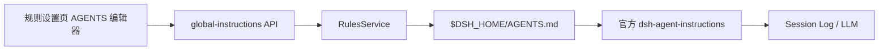

# DSH Rules 融合全局 AGENTS.md 编辑能力实施计划

> **供执行代理使用：** 必须使用 `subagent-driven-development`（推荐）或 `executing-plans` 按任务执行，并逐项更新复选框。

**目标：** 在 `dsh-rules` 的现有“规则”设置页顶部加入 `$DSH_HOME/AGENTS.md` 编辑器，替代 `dsh-global-rules` 的使用场景，同时保持官方 `dsh-agent-instructions` 负责模型上下文生效。

**架构：** `RulesService` 新增一个固定路径的全局指令仓储，Web 插件通过独立的同源 loopback API 暴露严格读写 contract；浏览器侧使用独立 API、latest-wins controller 和纯展示组件，并通过现有 `settings.section` inject face 装配。保存采用 `writeFileAtomic` 的 last-writer-wins 语义，不把 AGENTS.md 内容并入 `dsh-rules/context`。

**技术栈：** TypeScript 6、Cordis 4、React 18、DSH Client slots/SnapshotStore/UI primitives、CSS Modules、Node test、Playwright。

---

## 摘要

- 面向通过 DSH Web 或 DSH Desktop 设置页维护个人全局指令的用户。
- 仅编辑用户全局文件 `$DSH_HOME/AGENTS.md`；不支持项目根、子目录、`CLAUDE.md` 或 local overlay。
- AGENTS.md 编辑器位于现有 Cursor Rules 管理区域上方，共用一个“规则”设置入口。
- 缺失文件由 `{ exists: false, path }` 表示，不从后端伪造空正文；前端为新文件建立空草稿，不预填模板或默认规则。
- 空内容允许保存，并以 `0600` 权限保留空文件。
- 保存为强制覆盖：不携带 expected revision，不做三方合并；原子替换保证读者只看到完整旧内容或完整新内容。
- 官方 `@deepseek-ai/dsh-agent-instructions` 继续负责首次加载、Session Log 和当前会话更新；本插件不复制该链路。
- 不修改 `dsh-global-rules`、`deepseek-harness`、`deepseek-harness-desktop`，不更新 `dsh-rules` 版本号。

## 当前状态分析

1. `dsh-global-rules/lib/index.js` 直接读写 `~/.dsh/AGENTS.md`，具有 256 KiB 请求上限和同源校验，但没有 TypeScript contract、原子写、严格响应解析、生命周期化 controller 或官方组件样式。
2. `dsh-rules/src/index.ts` 已把配置与本地仓储收口到 `RulesService`；`src/host/repository.ts` 已使用 `writeFileAtomic`，适合复用同一安全基线。
3. `dsh-rules/src/host/http-handler.ts` 已实现 loopback Host/Origin 校验、JSON Content-Type、AbortSignal 和结构化错误，但相关辅助函数仍是私有实现。
4. `dsh-rules/src/client/` 已遵循官方 slot inject、SnapshotStore、latest-wins、CSS Modules 和 locale 模式；新增能力应沿用该结构，不把 fetch 或外部订阅放进组件。
5. Harness 的 `dsh-agent-instructions` 固定读取 `$DSH_HOME/AGENTS.md`，并在首次请求、恢复或后续成功 `read`/`write`/`edit` 后处理变更。本插件只负责编辑文件。
6. Desktop 使用普通 loopback Web carrier 和 DSH Client 模块图；保持普通 Web 插件接口即可同时适配 Desktop compatibility/advanced 模式，无需 Electron API 或 Desktop 私有服务。

## 接口与失败语义

新增固定路径：

```ts
export const GLOBAL_INSTRUCTIONS_API_PATH = '/dsh-rules/global-instructions'
```

Wire 返回使用可辨识联合，字段缺失直接视为 contract error：

```ts
// src/types.ts 是 Host 与 Client 共用的唯一类型来源。
export type GlobalInstructionsView =
  | {
      readonly exists: false
      readonly path: string
    }
  | {
      readonly exists: true
      readonly path: string
      readonly content: string
      readonly revision: GlobalInstructionsRevision
    }

export interface SaveGlobalInstructionsRequest {
  readonly action: 'save'
  readonly content: string
}

export type GlobalInstructionsResponse =
  | RulesApiSuccess<GlobalInstructionsView>
  | RulesApiFailure
```

HTTP 语义：

| 请求 | 成功 | 失败 |
|---|---|---|
| `GET /dsh-rules/global-instructions` | `200` + exists union | 不可信 Host `403`；非法文件/超限 `400`；其他 `500` |
| `POST /dsh-rules/global-instructions` | `200` + 写入后的 exists=true view | Origin 缺失或不匹配 `403`；非 JSON `415`；非法 payload/超限 `400`；其他 `500` |

保存不接受 revision。`revision` 仅用于标识当前响应内容，不阻止覆盖。

## 变更文件总览

**新增：**

- `dsh-rules/src/host/global-instructions-repository.ts`
- `dsh-rules/src/host/global-instructions-http-handler.ts`
- `dsh-rules/src/host/http-utils.ts`
- `dsh-rules/src/client/global-instructions-api.ts`
- `dsh-rules/src/client/global-instructions-store.ts`
- `dsh-rules/src/client/GlobalInstructionsEditor.tsx`
- `dsh-rules/src/client/GlobalInstructionsEditor.module.css`
- `dsh-rules/test/global-instructions-repository.test.ts`

**修改：**

- `dsh-rules/src/config.ts`
- `dsh-rules/src/types.ts`
- `dsh-rules/src/contract.ts`
- `dsh-rules/src/index.ts`
- `dsh-rules/src/web.ts`
- `dsh-rules/src/host/errors.ts`
- `dsh-rules/src/host/http-handler.ts`
- `dsh-rules/src/client/index.ts`
- `dsh-rules/src/client/RulesSection.tsx`
- `dsh-rules/src/client/RulesSection.module.css`
- `dsh-rules/src/client/locales.ts`
- `dsh-rules/test/http.test.ts`
- `dsh-rules/test/plugin.test.ts`
- `dsh-rules/test/repository.test.ts`
- `dsh-rules/test/rules.client.test.ts`
- `dsh-rules/test/e2e/rules-ui.e2e.ts`
- `dsh-rules/cordis.patch.yml`
- `dsh-rules/README.md`
- `dsh-rules/docs/design.md`
- `dsh-rules/package.json`

`package.json` 只更新 description/keywords 等能力说明；保持 `version: 0.2.0`，因此不应改动 `pnpm-lock.yaml`。

## 实施任务

### 任务 1：定义配置、类型与全局指令仓储

**文件：**

- 修改 `src/config.ts`
- 修改 `src/types.ts`
- 修改 `src/index.ts`
- 新增 `src/host/global-instructions-repository.ts`
- 新增 `test/global-instructions-repository.test.ts`
- 修改 `test/repository.test.ts`
- 修改 `test/plugin.test.ts`

- [ ] **步骤 1：先写仓储失败测试**

覆盖以下行为：

```ts
test('reads a missing global AGENTS.md without inventing content', async () => {
  const value = await repository.read()
  assert.deepEqual(value, { exists: false, path: join(home, 'AGENTS.md') })
})

test('atomically creates, overwrites, and preserves an empty AGENTS.md', async () => {
  await repository.write('first')
  await repository.write('')
  assert.equal(await readFile(join(home, 'AGENTS.md'), 'utf8'), '')
  assert.equal((await stat(join(home, 'AGENTS.md')).mode & 0o077, 0)
})
```

另测：

- 已存在普通文件返回原文和 SHA-256 revision。
- 超过 `maxAgentsBytes` 的读写返回 `invalid-instructions`。
- 目录或最终组件 symlink 被拒绝，浏览器不能借编辑器读取其他目标。
- 多字节 UTF-8 按字节计数。

- [ ] **步骤 2：运行仓储测试并确认失败**

```bash
pnpm exec tsx --test test/global-instructions-repository.test.ts
```

预期：因仓储、配置项和类型尚不存在而失败。

- [ ] **步骤 3：加入配置和领域类型**

在 `Config`、Schemastery schema、`ResolvedConfig` 和 `resolveConfig()` 中加入：

```ts
readonly maxAgentsBytes: number

maxAgentsBytes: z.number().step(1).min(1).default(1_048_576)
```

在 `types.ts` 中加入 Host 与 Client 共用的唯一 view 定义：

```ts
export type GlobalInstructionsRevision = Branded<'GlobalInstructionsRevision'>

export type GlobalInstructionsView =
  | { readonly exists: false; readonly path: string }
  | {
      readonly exists: true
      readonly path: string
      readonly content: string
      readonly revision: GlobalInstructionsRevision
    }
```

- [ ] **步骤 4：实现固定路径仓储**

`GlobalInstructionsRepository`：

- 路径只能由 `join(config.dshHome, 'AGENTS.md')` 产生，不接受浏览器路径。
- `read()` 使用 `lstat` 后确认普通非 symlink 文件，再做有界 `readFile`。
- 缺失返回 `exists: false`，不携带 `content`/`revision`。
- `write(content)` 先做 UTF-8 字节检查，再调用：

```ts
await writeFileAtomic(path, content, { mode: 0o600, dirMode: 0o700 })
```

- 写入后重新读取并返回当前 view。
- 写入是 last-writer-wins，不调用 `withFileLock` 做 revision 比较。

`RulesService` 持有该仓储，并提供：

```ts
readGlobalInstructions(signal?: AbortSignal): Promise<GlobalInstructionsView>
writeGlobalInstructions(content: string, signal?: AbortSignal): Promise<GlobalInstructionsView>
```

- 在 `test/repository.test.ts`、`test/plugin.test.ts` 与 `test/http.test.ts` 的现有 `ResolvedConfig`/`ctx.plugin()` fixture 中补齐 `maxAgentsBytes: 1_048_576`。

- [ ] **步骤 5：运行仓储和现有 repository 测试**

```bash
pnpm exec tsx --test test/global-instructions-repository.test.ts test/repository.test.ts
```

预期：全部通过，现有 Cursor Rules 仓储语义不变。

### 任务 2：建立严格 contract 与独立 HTTP route

**文件：**

- 修改 `src/contract.ts`
- 修改 `src/host/errors.ts`
- 新增 `src/host/http-utils.ts`
- 修改 `src/host/http-handler.ts`
- 新增 `src/host/global-instructions-http-handler.ts`
- 修改 `src/web.ts`
- 修改 `test/http.test.ts`

- [ ] **步骤 1：先写 HTTP 失败测试**

新增测试覆盖：

- 缺失 GET 返回 `{ exists: false, path }`，没有 `content`。
- POST `{ action: 'save', content: '' }` 创建空文件并返回 exists=true。
- 再次 POST 强制覆盖原内容，不要求 revision。
- malformed JSON、缺失 `action`/`content`、非字符串 content、错误 Content-Type。
- 不可信 Host、缺失或不匹配的 mutation Origin、`sec-fetch-site: cross-site`。
- 超限正文映射为 `400 invalid-instructions`。
- method 不支持时返回 `405` 和 `Allow: GET, POST`。
- 现有 Rules POST/DELETE 同样拒绝缺失 Origin，使实现与 `docs/design.md` 的 mutation 约束一致；GET 继续允许浏览器省略 Origin。

- [ ] **步骤 2：运行 HTTP 测试并确认失败**

```bash
pnpm exec tsx --test test/http.test.ts
```

- [ ] **步骤 3：扩展共享 contract**

加入：

- `GLOBAL_INSTRUCTIONS_API_PATH`
- 从 `types.ts` 导入并复用 `GlobalInstructionsView`
- `SaveGlobalInstructionsRequest`
- `GlobalInstructionsResponse`
- `parseSaveGlobalInstructionsRequest()`
- `parseGlobalInstructionsResponse()`
- 错误码 `invalid-instructions`

解析规则必须逐字段校验：`exists: false` 不接受伪造正文；`exists: true` 必须同时包含字符串 `content` 与 `revision`。

- [ ] **步骤 4：提取 HTTP 公共基础设施**

把现有 handler 的以下逻辑原样迁移到 `src/host/http-utils.ts`，保持现有 Rules API 行为：

- `sendJson`
- 结构化 `failure`
- 有界 `readJsonBody`
- `requestSignal`
- loopback Host/Origin/Fetch-Metadata 校验；helper 显式接收 `requireOrigin`，mutation 传 `true`
- `RulesError` 到 HTTP status 的映射

不要在两个 handler 中复制安全检查。

- [ ] **步骤 5：实现并注册新 handler**

`createGlobalInstructionsHttpHandler(ctx)`：

- 所有请求先通过共享 loopback 信任检查。
- GET 调 `ctx.rules.readGlobalInstructions(signal)`。
- POST 只接收 JSON，严格解析 `{ action: 'save', content }`，调用 `writeGlobalInstructions`。
- 请求体上限使用 `Math.min(Number.MAX_SAFE_INTEGER, maxAgentsBytes * 6 + 65_536)`，覆盖单字节正文最坏的 JSON 转义膨胀；最终正文仍由仓储按 UTF-8 字节再次校验。
- 未知异常只返回通用 `internal` 消息，不泄露本机细节。

`web.ts` 用两个独立 `ctx.effect()` 注册 `/dsh-rules/api` 和 `/dsh-rules/global-instructions`，两者都随 fiber 卸载。

- [ ] **步骤 6：运行 HTTP、插件与类型检查**

```bash
pnpm exec tsx --test test/http.test.ts test/plugin.test.ts
pnpm typecheck
```

### 任务 3：实现浏览器 API 与 latest-wins controller

**文件：**

- 新增 `src/client/global-instructions-api.ts`
- 新增 `src/client/global-instructions-store.ts`
- 修改 `test/rules.client.test.ts`

- [ ] **步骤 1：先写严格 Client 测试**

覆盖：

```ts
test('rejects an exists=true response without content', async () => {
  const api = new GlobalInstructionsApi((async () => Response.json({
    ok: true,
    value: { exists: true, path: '/home/AGENTS.md', revision: 'r1' },
  })) as typeof fetch)
  await assert.rejects(
    api.read(),
    (error: unknown) => error instanceof RulesClientError
      && error.code === 'contract'
      && /content/.test(error.message),
  )
})

test('keeps only the latest instructions load result', async () => {
  const first = deferred<GlobalInstructionsView>()
  const second = deferred<GlobalInstructionsView>()
  let calls = 0
  const api = {
    read: async () => (++calls === 1 ? first.promise : second.promise),
  } as unknown as GlobalInstructionsApi
  const controller = new GlobalInstructionsPageController(
    api,
    memoryStore(initialGlobalInstructionsPageState()),
  )
  const oldLoad = controller.load()
  const newLoad = controller.load()
  second.resolve({ exists: false, path: '/new/AGENTS.md' })
  await newLoad
  first.resolve({ exists: false, path: '/old/AGENTS.md' })
  await oldLoad
  assert.equal(controller.store.getSnapshot().file?.path, '/new/AGENTS.md')
})

test('publishes the exact saved empty document', async () => {
  const saved: GlobalInstructionsView = {
    exists: true,
    path: '/home/AGENTS.md',
    content: '',
    revision: 'r1' as GlobalInstructionsRevision,
  }
  const api = {
    read: async () => ({ exists: false, path: '/home/AGENTS.md' }),
    save: async () => saved,
  } as unknown as GlobalInstructionsApi
  const controller = new GlobalInstructionsPageController(
    api,
    memoryStore(initialGlobalInstructionsPageState()),
  )
  await controller.load()
  assert.equal(await controller.save(''), true)
  assert.deepEqual(controller.store.getSnapshot().file, saved)
})
```

另测结构化后端错误、dispose 后迟到结果、保存失败后保留最近一次已加载 view。

- [ ] **步骤 2：运行 Client 测试并确认失败**

```bash
pnpm exec tsx --test test/rules.client.test.ts
```

- [ ] **步骤 3：实现严格 API adapter**

`GlobalInstructionsApi` 只调用固定路径：

```ts
read(signal?: AbortSignal): Promise<GlobalInstructionsView>
save(content: string, signal?: AbortSignal): Promise<GlobalInstructionsView>
```

沿用 `RulesClientError` 和共享 failure envelope；成功响应必须经过 `parseGlobalInstructionsResponse()`，不使用 `data.content || ''`、`Boolean(data.exists)` 等回退。

- [ ] **步骤 4：实现 controller**

状态：

```ts
interface GlobalInstructionsPageState {
  status: 'idle' | 'loading' | 'ready' | 'error'
  error: string | null
  file: GlobalInstructionsView | null
  mutation: 'idle' | 'saving'
  saved: boolean
}
```

行为：

- `load()` 使用 generation + AbortController，latest-wins。
- 初次请求失败时 `file` 保持 `null`，UI 不构造后端数据。
- 刷新失败时保留最后成功 view，同时展示错误。
- `save(content)` 在成功后直接发布服务器返回 view；失败不清空已加载 view。
- 新 load/save 清除旧的 saved notice。
- `dispose()` 中止请求并阻止迟到发布。

- [ ] **步骤 5：运行 Client 测试与 Client 类型检查**

```bash
pnpm exec tsx --test test/rules.client.test.ts
pnpm exec tsc -p tsconfig.tests.client.json --noEmit --pretty false
```

### 任务 4：在规则页顶部装配 AGENTS.md 编辑器

**文件：**

- 新增 `src/client/GlobalInstructionsEditor.tsx`
- 新增 `src/client/GlobalInstructionsEditor.module.css`
- 修改 `src/client/RulesSection.tsx`
- 修改 `src/client/RulesSection.module.css`
- 修改 `src/client/locales.ts`
- 修改 `src/client/index.ts`

- [ ] **步骤 1：扩展 inject face**

`client/index.ts` 在 `apply()` 内创建 controller；不创建模块级 store handle。`RulesSectionInjected` 增加：

```ts
readonly hooks: {
  readonly rules: SnapshotStore<RulesPageState>
  readonly globalInstructions: SnapshotStore<GlobalInstructionsPageState>
}
readonly loadGlobalInstructions: () => Promise<void>
readonly saveGlobalInstructions: (content: string) => Promise<boolean>
```

`ctx.effect()` 同时 dispose 两个 controller。组件只通过框架生成的 `useGlobalInstructions` hook 和 plain callbacks 读取能力，不接触 `ctx` 或原始 observable。

- [ ] **步骤 2：实现纯展示编辑器**

`GlobalInstructionsEditor` 接收已选出的 snapshot、翻译函数和回调：

- heading 为 `AGENTS.md`，显示后端返回的实际路径。
- `file.exists === false` 时显示“尚未创建”状态，并建立本地空草稿；不显示模板或默认正文。
- `file.exists === true` 时精确载入 `content`，包括空字符串。
- textarea 为等宽字体、可纵向调整、无默认 value fallback。
- 保存按钮使用官方 `Button` 和 `IconCheckOutline16`；加载/保存期间禁用。
- 缺失文件即使草稿为空也允许保存，以创建空文件。
- 已存在文件仅在草稿变化后允许保存。
- 成功、错误、加载中和未创建状态均可访问；错误使用 `role="alert"`。
- 页面 refresh 明确重新读取文件并重置草稿；不做自动轮询。

- [ ] **步骤 3：调整页面编排**

`RulesSection`：

1. 顶部保留一个“规则”页面标题和 refresh 图标。
2. mount 时并行调用 `loadGlobalInstructions()` 与现有目标 rules `load(target)`。
3. refresh 同时刷新 AGENTS.md 与当前 scope 的 Cursor Rules。
4. `GlobalInstructionsEditor` 位于现有 `data-rules-panel` 之前。
5. 现有规则创建、编辑、分页、全局/项目切换行为不变。

- [ ] **步骤 4：补齐中英文文案和样式**

新增 locale key 至少包含：

- `globalInstructionsTitle`
- `globalInstructionsStatusMissing`
- `globalInstructionsStatusSaved`
- `globalInstructionsContent`
- `cursorRulesTitle`
- `loadingGlobalInstructions`
- `saveGlobalInstructions`

样式要求：

- 新组件只消费 `--dsw-alias-*` 语义 token，不加 `prefers-color-scheme` 分支或字面颜色。
- 卡片圆角不超过 8px；两个区域之间使用固定垂直间距。
- textarea、路径和按钮在 390px 与 1280px 视口不溢出。
- 保留键盘 focus 可见性。
- 不使用嵌套卡片或内联主题样式。

- [ ] **步骤 5：运行类型、单测和构建**

```bash
pnpm typecheck
pnpm test
pnpm build
```

### 任务 5：更新真实组合 E2E

**文件：**

- 修改 `test/e2e/rules-ui.e2e.ts`

- [ ] **步骤 1：扩展 E2E 场景**

在现有临时 `DSH_HOME` 中预置确定内容的 `AGENTS.md`，验证：

1. 安装插件并启动真实 `dsh web` 后，规则页顶部显示准确内容和路径。
2. 编辑并保存后，磁盘 `$DSH_HOME/AGENTS.md` 内容完全一致。
3. 清空并保存后，文件仍存在且内容为零字节。
4. Cursor Rules 创建、四模式、分页、主题和 locale 原场景继续通过。
5. 中文、English、浅色、深色下 AGENTS 区域均可用。
6. 1280×800 与 390×844 均无横向溢出，移动视口中文本和操作按钮不重叠。

- [ ] **步骤 2：扩展运行时证据**

至少新增：

- `rules-agents-loaded.png`
- `rules-agents-saved.png`
- `rules-agents-mobile.png`

报告步骤记录 AGENTS 加载、保存、空文件保留和移动视口检查；失败时继续保留现场截图。

- [ ] **步骤 3：运行 E2E**

```bash
pnpm test:e2e
```

预期：真实 Loader、Host route、Client bundle、浏览器交互和磁盘内容全部通过；HTML/JSON 报告生成在 `output/playwright/`。

### 任务 6：更新配置、文档和发布产物说明

**文件：**

- 修改 `cordis.patch.yml`
- 修改 `README.md`
- 修改 `docs/design.md`
- 修改 `package.json`

- [ ] **步骤 1：接线配置**

在 `rules-service` 默认配置加入：

```yaml
maxAgentsBytes: 1048576
```

不新增 Cordis row；AGENTS 仓储仍由现有 `RulesService` 拥有。

- [ ] **步骤 2：更新 README**

明确记录：

- 新能力和路径 `$DSH_HOME/AGENTS.md`。
- 设置页结构：AGENTS.md 在上，Cursor Rules 在下。
- 缺失时保存创建文件；清空保存保留空文件。
- last-writer-wins 覆盖语义。
- 当前会话何时由官方 `dsh-agent-instructions` 感知更新。
- `maxAgentsBytes` 配置。
- 仅支持全局 AGENTS.md，不支持项目/子目录/CLAUDE。
- 已安装 `dsh-global-rules` 的用户可卸载旧插件；文件无需迁移。
- Model Experience 不增加新的模型消息，AGENTS 内容仍由官方插件注入。

- [ ] **步骤 3：更新设计文档**

在 `docs/design.md` 的边界、数据流、仓储、Web API、Client、生命周期和不支持列表中加入全局指令链路：



强调 Web 管理能力与模型注入能力分属本插件和官方插件。

- [ ] **步骤 4：更新包说明但不改版本**

`package.json` description/keywords 加入 AGENTS/global instructions；保持 `version`、依赖与 lockfile 不变。

## 假设与已确认决策

- `$DSH_HOME` 使用 `RulesService` 已解析的 `dshHome`，不重新读取 `homedir()`。
- API 和 UI 只处理 UTF-8 文本。
- 空文件是合法状态，不等价于删除。
- 保存总是覆盖，不提示外部修改冲突；这是明确产品决策。
- 文件读取拒绝最终组件 symlink；原子写也不会跟随 symlink。
- 不提供删除按钮。需要删除时由用户在文件系统操作。
- 不预览 Markdown，不引入编辑器库、语法高亮、自动保存、历史版本或项目 AGENTS 管理。
- 不修改官方 `agent-instructions` 配置，也不检测它是否被 profile 禁用；README 说明生效依赖官方插件。
- `maxAgentsBytes` 只约束编辑 API；官方 `agent-instructions.maxSourceBytes` 是独立部署配置。默认值对齐为 1 MiB，但任一侧被单独修改时以各自配置为准。
- 不在本次顺带重构现有 Cursor Rules 的配色和样式体系。
- 不自动创建 git commit；提交策略由后续执行指令决定。

## 兼容、迁移与发布

- 现有 `rules/**/*.md` 文件、API 与模型上下文事件不迁移，原行为保持兼容。
- `dsh-global-rules` 与新 route 不发生路径冲突，但同时安装会出现两个编辑同一文件的入口；文档要求升级后卸载旧插件，不增加运行时探测。
- `$DSH_HOME/AGENTS.md` 原文件原位复用，无复制、格式转换或备份步骤。
- 本次不改版本号、不自动提交、不发布 npm；实现完成后以 `pnpm pack` 验证产物。
- 该能力只操作本地文件和 loopback API，不新增遥测或监控。错误通过结构化 API 与设置页 `role="alert"` 暴露。

## 最终验证

按以下顺序运行，失败时只修复本次变更引入的问题：

```bash
cd /Users/bytedance/dsh/dsh-rules
pnpm typecheck
pnpm test
pnpm build
pnpm test:e2e
pnpm pack
git diff --check
git status --short
```

验收标准：

- `pnpm check` 等价门禁全部通过。
- tarball 包含更新后的 Host、Client、contract 类型和文档。
- 真实 Web E2E 能读、写、清空并保留 `$DSH_HOME/AGENTS.md`。
- 现有 Cursor Rules 与 context/model 行为测试无回归。
- 成功响应缺字段时 Client 明确报 contract error。
- 后端缺失文件时 UI 不注入任何默认规则正文。
- Web 与 Desktop 共用的普通 DSH Client/loopback 接口未引入环境分支。
- 没有修改 `dsh-global-rules`、`deepseek-harness`、`deepseek-harness-desktop` 或 `pnpm-lock.yaml`。
