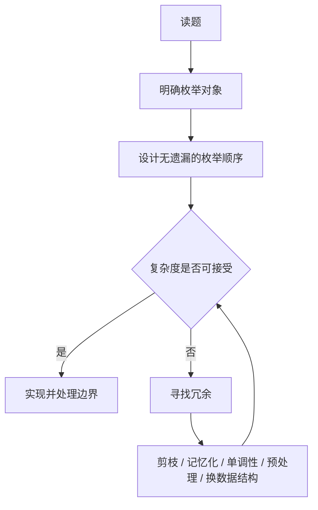
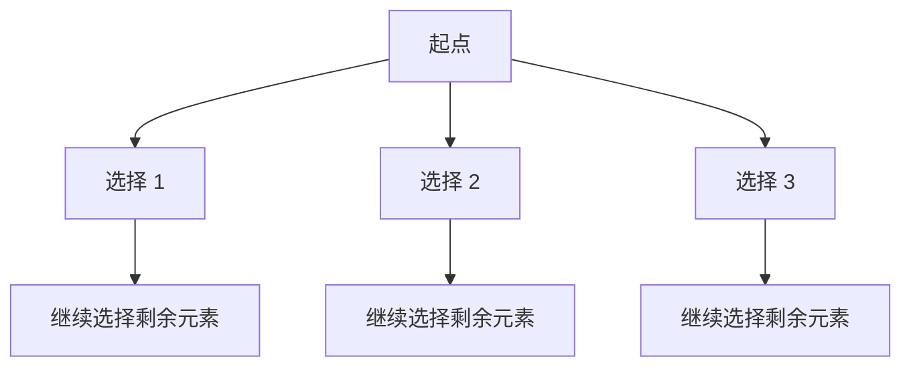

# 算法思想与技巧

参考资料：

- [labuladong：算法总结篇](https://labuladong.online/zh/algo/essential-technique/algorithm-summary/)
- [Britannica：algorithm](https://www.britannica.com/science/algorithm)
- [HandWiki：Brute-force search](https://handwiki.org/wiki/Brute-force_search)
- [Timefold：Exhaustive search](https://timefold.ai/docs/timefold-solver/latest/optimization-algorithms/exhaustive-search)

## 一句话本质

**算法是可重复解决同类问题的方法。**

在面试算法中，**枚举**是最基础、最通用的算法思想之一；大多数算法技巧，本质上都是在明确枚举对象后，让枚举过程做到：

| 目标 | 含义 |
|---|---|
| 无遗漏 | 所有可能答案都被覆盖，保证正确性 |
| 少冗余 | 尽量避免重复、无效、必然失败的枚举，优化复杂度 |

所以，学习算法不是背模板，而是学习如何**科学地枚举**。

## 表述边界

“大多数算法技巧都是枚举优化”适合用来理解**数据结构与算法面试题**，但不是所有算法的统一解释。

| 范围 | 是否适用 | 说明 |
|---|---:|---|
| 数组、链表、树、图、字符串题 | 是 | 多数题都能还原成枚举位置、节点、路径、状态 |
| 回溯、动态规划、搜索、双指针、二分、滑窗 | 是 | 都是在组织、压缩或剪枝枚举空间 |
| 贪心 | 部分适用 | 不是完整枚举，而是证明局部选择可替代全量枚举 |
| 密码学、数值计算、机器学习算法 | 不强行套用 | 更依赖数学模型、概率统计或数值方法 |

本文只讨论面试常见的“计算机算法”，即如何用程序高效解决确定性问题。

## 算法和程序的区别

| 概念 | 关注点 | 例子 |
|---|---|---|
| 算法 | 解决同类问题的方法 | 二分查找、归并排序、动态规划 |
| 程序 | 某种语言里的具体实现 | JavaScript 写的二分函数 |
| 数据结构 | 数据的组织和访问方式 | 数组、链表、栈、队列、树、图 |

## 数据结构的作用

数据结构是算法的基础设施。

| 数据结构 | 核心能力 | 对枚举的影响 |
|---|---|---|
| 数组 | 连续存储、按下标随机访问 | 适合枚举区间、下标、前缀信息 |
| 链表 | 非连续存储、指针连接 | 适合局部增删，但不适合随机访问 |
| 栈 | 后进先出 | 适合维护递归路径、单调结构 |
| 队列 | 先进先出 | 适合层序遍历、BFS |
| 哈希表 | 快速查找 | 用空间换时间，减少查找枚举 |
| 树 | 层级关系 | 适合递归枚举子问题、路径、子树 |
| 图 | 任意关系 | 适合枚举节点、边、路径、连通性 |

数据结构决定了枚举的成本。  
算法技巧则是在这个基础上决定“枚举什么、按什么顺序枚举、哪些可以不枚举”。

## 科学枚举三问

遇到一道算法题，先问三个问题：

| 问题 | 要解决什么 | 常见形式 |
|---|---|---|
| 枚举什么 | 明确搜索空间 | 下标、区间、节点、路径、状态、答案 |
| 如何不漏 | 保证正确性 | 循环、递归、遍历框架、状态转移 |
| 如何不重 | 优化复杂度 | 剪枝、记忆化、单调性、预处理、数据结构 |

## 常见技巧如何优化枚举

| 技巧 | 原始枚举 | 优化方式 | 关键条件 |
|---|---|---|---|
| 双指针 | 双重循环枚举两个位置 | 指针单向移动，避免重复组合 | 有序、单调、可收缩 |
| 滑动窗口 | 枚举所有子数组 | 维护左右边界和窗口状态 | 连续区间、窗口可扩缩 |
| 二分搜索 | 顺序枚举位置或答案 | 每次排除一半搜索空间 | 有序性、二段性 |
| 前缀和 | 每次重新计算区间 | 预处理区间信息 | 区间查询频繁 |
| 差分数组 | 每次枚举区间修改 | 只记录边界变化 | 区间修改频繁 |
| 单调栈 | 为每个元素向两边搜索 | 维护候选元素单调性 | 最近更大/更小元素 |
| 哈希表 | 线性查找目标元素 | 用空间换 O(1) 查询 | 需要快速判断存在性 |
| 回溯 | 枚举所有选择路径 | 递归试错，提前剪枝 | 组合、排列、子集、约束满足 |
| BFS | 枚举所有路径 | 按层扩展，第一次到达即最短 | 无权图、最短步数 |
| 动态规划 | 重复枚举子问题 | 状态复用，避免重复计算 | 重叠子问题、最优子结构 |
| 贪心 | 枚举所有方案再取最优 | 用局部最优替代全局搜索 | 贪心选择性质可证明 |

## 两类核心难点

labuladong 将算法的难点概括为“无遗漏、无冗余”，这个判断非常适合作为学习主线。

| 难点 | 典型错误 | 对应训练 |
|---|---|---|
| 不知道如何枚举 | 想不到递归定义、状态定义、遍历顺序 | 多练树、回溯、动态规划 |
| 枚举太慢 | 暴力解正确但超时 | 学会剪枝、记忆化、单调性和预处理 |

换句话说：

- **正确性问题**：你有没有把所有可能答案覆盖到？
- **复杂度问题**：你有没有把不必要的枚举删掉？

## 典型例子

### 1. 两数之和

暴力解法：枚举所有 `(i, j)`，时间复杂度 `O(n^2)`。

优化思路：枚举当前数 `nums[i]`，用哈希表快速判断 `target - nums[i]` 是否出现过。

| 版本 | 枚举对象 | 冗余在哪里 | 优化后 |
|---|---|---|---|
| 暴力 | 所有二元组 | 反复线性查找另一个数 | `O(n^2)` |
| 哈希表 | 当前数 | 查找成本降为 `O(1)` | `O(n)` |

### 2. 子数组问题

暴力解法：枚举所有左右边界，再计算区间信息。

优化方向：

| 问题类型 | 优先技巧 | 原因 |
|---|---|---|
| 频繁求区间和 | 前缀和 | 区间和可由两个前缀相减得到 |
| 连续子数组满足条件 | 滑动窗口 | 左右边界可以单向移动 |
| 子数组和等于目标值 | 前缀和 + 哈希表 | 枚举右端点，快速查找需要的左侧前缀 |

### 3. 排列组合

暴力思维：答案是所有可能选择路径。

回溯做法：把选择过程抽象成一棵树。

回溯不是“高级魔法”，而是**系统枚举选择树**：

| 组成 | 含义 |
|---|---|
| 路径 | 已经做出的选择 |
| 选择列表 | 当前还能选什么 |
| 结束条件 | 什么时候得到一个答案 |
| 剪枝条件 | 哪些分支不可能产生合法答案 |

### 4. 动态规划

动态规划的起点通常是暴力递归。

如果递归过程中大量子问题被重复计算，就可以用 `memo` 或 `dp` 表保存结果。

| 阶段 | 含义 |
|---|---|
| 暴力递归 | 明确如何枚举所有子问题 |
| 记忆化搜索 | 保存已经算过的子问题 |
| 递推 DP | 按依赖顺序填表 |
| 空间优化 | 只保留必要状态 |

动态规划不是跳过枚举，而是把重复枚举压缩成一次计算。

## 学习路线

后续学习算法技巧时，不要只记模板，要反复问：

| 学习对象 | 关键问题 |
|---|---|
| 数据结构 | 它让哪些访问更快？让哪些操作更慢？ |
| 遍历框架 | 它按什么顺序覆盖所有情况？ |
| 算法技巧 | 它减少了哪部分枚举？ |
| 复杂度分析 | 枚举空间有多大？优化后少枚举了多少？ |
| 题目复盘 | 这题本质上在枚举什么？ |

推荐顺序：

1. 数组、链表：理解线性枚举。
2. 栈、队列、哈希表：理解如何用数据结构减少重复访问。
3. 双指针、滑动窗口、二分：理解单调性如何减少枚举。
4. 树、图：理解递归、DFS、BFS 如何组织非线性枚举。
5. 回溯：理解选择树和剪枝。
6. 动态规划：理解子问题枚举和结果复用。
7. 贪心：理解什么时候可以不完整枚举。

## 小结

算法学习可以压缩成一条主线：

记住三句话：

- 算法是可重复解决同类问题的方法。
- 枚举是面试算法中最基础、最通用的思想之一。
- 大多数算法技巧，都是为了让枚举更科学：不漏、不重、更快。
