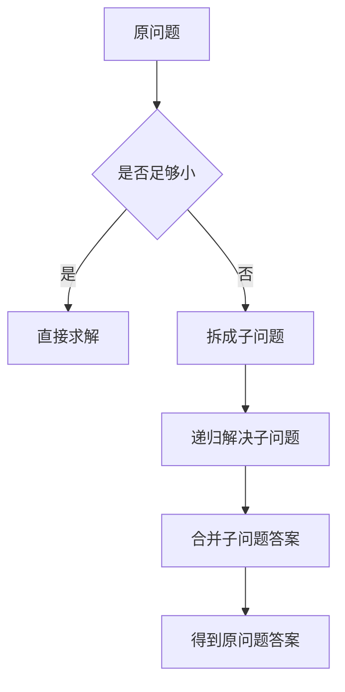

# 分治算法

参考资料：

- [Khan Academy：Divide and conquer algorithms](https://www.khanacademy.org/computing/computer-science/algorithms/merge-sort/a/divide-and-conquer-algorithms)
- [Washington CSE 417：Divide and Conquer](http://courses.cs.washington.edu/courses/cse417/25au/readings/divide_and_conquer.html)
- [腾讯云：图解分治算法和思想](https://cloud.tencent.cn/developer/article/1755519)

## 一句话本质

**分治算法，就是把一个大问题拆成多个更小的同类问题，分别解决后再合并答案。**

它的核心思想是“分而治之”：

| 步骤 | 含义 |
|---|---|
| 分 | 把原问题拆成规模更小的子问题 |
| 治 | 递归解决这些子问题 |
| 合 | 把子问题答案合并成原问题答案 |

## 核心流程

## 什么时候适合用分治

| 条件 | 说明 |
|---|---|
| 问题能拆小 | 大问题可以拆成若干个小问题 |
| 子问题同类 | 小问题和原问题结构相同，只是规模更小 |
| 子问题相对独立 | 左半部分、右半部分可以分别处理 |
| 答案能合并 | 子问题答案可以组合成原问题答案 |

如果子问题大量重复，通常更像动态规划；如果子问题不能合并，分治就不适合。

## 例子一：二分查找

在有序数组中找一个数。

| 步骤 | 做法 |
|---|---|
| 分 | 取中间位置，把数组分成左右两半 |
| 治 | 判断目标值在哪一半，只递归查找那一半 |
| 合 | 不需要合并，直接返回查找结果 |

二分查找每次排除一半元素，时间复杂度是 `O(log n)`。

## 例子二：归并排序

归并排序是最典型的分治算法。

| 步骤 | 做法 |
|---|---|
| 分 | 把数组从中间拆成左右两半 |
| 治 | 分别递归排序左右两半 |
| 合 | 把两个有序数组合并成一个有序数组 |

核心不是“直接排序整个数组”，而是先把小数组排好，再合并。

时间复杂度是 `O(n log n)`。

## 例子三：快速排序

快速排序也是分治思想。

| 步骤 | 做法 |
|---|---|
| 分 | 选择一个基准值，把数组分成小于基准和大于基准的两部分 |
| 治 | 递归排序左右两部分 |
| 合 | 左边 + 基准 + 右边天然有序，不需要复杂合并 |

快排平均时间复杂度是 `O(n log n)`，但如果每次划分极不均衡，最坏会退化到 `O(n^2)`。

## 例子四：最大子数组和

要求数组中连续子数组的最大和。

分治思路：

| 情况 | 含义 |
|---|---|
| 最大子数组在左半边 | 递归求左半边最大子数组和 |
| 最大子数组在右半边 | 递归求右半边最大子数组和 |
| 最大子数组跨过中点 | 从中点向左右扩展，求跨中点最大和 |

最终答案就是三者最大值。

这个例子能说明：分治的“合”不一定只是拼接，也可能要额外处理跨边界的情况。

## 和科学枚举的关系

分治本质上是在优化枚举方式：

| 暴力思路 | 分治优化 |
|---|---|
| 直接处理整个问题 | 先拆成小问题 |
| 枚举规模大 | 每次缩小问题规模 |
| 逻辑混在一起 | 分、治、合三个阶段清晰 |
| 难以复用 | 子问题复用同一套递归逻辑 |

分治不是跳过枚举，而是把枚举空间拆成更容易处理的层级结构。

## 小结

分治算法记住三句话：

- 大问题拆成小问题。
- 小问题和原问题长得一样，所以可以递归解决。
- 子问题答案必须能合并回原问题答案。

常见分治算法：二分查找、归并排序、快速排序、最大子数组、逆序对统计、最近点对。
