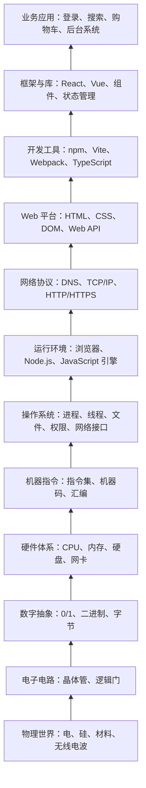

## 抽象是什么

抽象是学习编程和前端开发时非常重要的概念。

简单说，抽象就是：

> **保留当前需要关心的重点，隐藏暂时不需要关心的细节。**

人类的知识和注意力是有限的。一个真实系统往往非常复杂，如果什么细节都同时看，就很难理解、很难沟通，也很难创造新东西。

所以我们会自然地使用抽象。

例如高中生物里，我们可以从不同层级理解人体：

```text
人体
  ↓
系统
  ↓
器官
  ↓
组织
  ↓
细胞
  ↓
细胞器
  ↓
分子
  ↓
原子
  ↓
基本粒子
```

当我们讨论“消化系统”时，不需要立刻展开每个细胞器怎么工作；当我们讨论“细胞膜”时，也不需要同时讨论整个人体如何运动。

这不是因为底层不重要，而是因为：**不同问题需要站在不同层级上看**。

计算机和 Web 开发也是一样。

## 一、为什么抽象是编程的基石

如果完全不使用抽象，想做一个网页，理论上你要理解非常多东西：

- 电子如何在芯片里流动；
- 晶体管如何表示 `0` 和 `1`；
- CPU 如何执行机器指令；
- 操作系统如何管理内存和文件；
- 浏览器如何解析 HTML、CSS、JavaScript；
- 网络如何传输数据；
- React 如何把状态变化变成页面更新；
- 业务代码如何组织成真实应用。

这些知识当然都有价值，但如果要求一个新手全部懂了才能写网页，那几乎没人能开始。

抽象的作用就是：**让你可以先站在较高层级解决问题，而不必一次性理解所有底层细节**。

例如你写：

```js
console.log("Hello");
```

你只需要先知道：这行代码会把 `"Hello"` 输出到控制台。

至于字符串如何编码、JavaScript 引擎如何解析代码、CPU 最终执行了哪些机器指令、屏幕像素如何发光，这些细节可以以后再学。

这些细节不是不存在，而是被一层层工具和接口暂时隐藏起来了。

这就是抽象。

## 二、抽象不是“不懂底层”

抽象不等于逃避底层知识。

更准确地说，抽象是一种**分层理解**方式：

- 当前要写页面，就先理解 HTML、CSS、JavaScript。
- 页面卡顿时，再往下理解浏览器渲染、JavaScript 执行、内存占用。
- 请求失败时，再往下理解 HTTP、DNS、跨域、服务器响应。
- 构建报错时，再往下理解 Node.js、npm、Vite、Webpack。

也就是说：

> **平时依赖抽象提高效率，遇到问题时再向下追一层。**

这很像使用地图。只是从家去公司，看路线图就够了；如果要修路，就需要看道路结构；如果要建桥，就要看地质、水文和材料。

编程也是如此。前端开发者不必每天思考晶体管，但需要知道：自己的代码最终运行在浏览器里，浏览器运行在操作系统上，操作系统运行在计算机硬件上。

## 三、抽象的核心：接口和实现

理解抽象，最关键的是理解两个词：

- **接口**：你如何使用它。
- **实现**：它内部如何做到。

例如开车：

```text
接口：方向盘、油门、刹车
实现：发动机、变速箱、制动系统、电子控制系统
```

普通司机只需要理解接口，不需要理解完整发动机结构。

前端开发也一样。比如浏览器里的 `fetch`：

```js
const response = await fetch("/api/user");
const user = await response.json();
```

对前端开发者来说，`fetch` 的接口是：

```text
给它一个 URL，它帮你发请求，并返回响应结果。
```

但它内部隐藏了很多实现细节：如何建立网络连接、如何组织 HTTP 请求、如何等待服务器响应、如何把结果交给 JavaScript。

你不需要每次发请求时都手写 TCP/IP 细节，因为浏览器已经把这些复杂过程抽象成了 `fetch()`。

这里就可以顺带理解前端里经常出现的一个词：**API**。

API 是 `Application Programming Interface` 的缩写，通常翻译为“应用程序编程接口”。它本质上就是一种给程序使用的接口：**你按照它规定的方式调用，就能使用某种能力，而不必理解内部完整实现**。

在前端开发里，API 常见有两类：

| 类型 | 例子 | 它隐藏了什么 |
| --- | --- | --- |
| 浏览器 API | `fetch()`、`localStorage`、`document.querySelector()` | 浏览器、网络、存储、DOM 操作的底层细节 |
| 后端接口 API | `GET /api/user`、`POST /api/login` | 后端业务逻辑、数据库查询、服务内部实现 |

所以，API 可以看作“接口与实现”这组概念在前端开发中的具体表现。前端工程师大量工作都是在使用各种 API：调用浏览器能力、请求后端数据、接入第三方服务。

## 四、抽象有什么用

抽象不是为了让概念变“高级”，而是为了实际降低复杂度。

| 作用 | 含义 | 例子 |
| --- | --- | --- |
| 降低理解成本 | 先学会如何使用，再慢慢理解如何实现 | 先会读写文件，再学文件系统 |
| 提高复用性 | 把一段逻辑封装起来反复使用 | 用函数封装“计算总价” |
| 隐藏变化 | 接口不变时，内部实现可以调整 | 后端从 MySQL 换 Redis，前端接口不变 |
| 支持协作 | 不同人负责不同层级 | 前端按接口渲染，后端按接口返回 |
| 接近业务表达 | 用人的概念写代码 | 用户、订单、购物车、登录状态 |

函数就是最常见的抽象：

```js
function calculateTotal(price, count) {
  return price * count;
}
```

以后使用者只需要调用 `calculateTotal(99, 3)`，不必每次都重新写“单价乘以数量”。

函数名把一段处理逻辑抽象成了一个可复用能力。

## 五、计算机系统本身就是层层抽象

计算机不是一整块平面结构，而是一层叠一层搭起来的。

越底层，越接近物理世界，细节更多，控制力更强，但理解成本也更高。

越上层，越接近人的需求，使用更方便，表达能力更强，但对底层控制更少。

下面是一张从底层到顶层的架构图：



可以把它和人体结构类比：

| 生物层级 | 计算机/Web 层级 |
| --- | --- |
| 基本粒子 | 电信号、材料、物理现象 |
| 原子/分子 | 晶体管、逻辑门 |
| 细胞器/细胞 | CPU、内存、硬盘、网卡 |
| 组织/器官 | 操作系统、浏览器、Node.js |
| 系统 | 网络协议、Web 平台、前后端架构 |
| 人体行为 | 用户能使用的 Web 应用 |

学习前端时，我们主要站在上层：

```text
Web 平台 -> 开发工具 -> 框架与库 -> 业务应用
```

但遇到问题时，经常需要向下理解一层：

- 页面白屏：看浏览器控制台、JS 执行、资源加载。
- 接口失败：看 HTTP 请求、网络、后端响应。
- 样式不生效：看 CSS 规则、选择器优先级、浏览器渲染。
- 页面卡顿：看 JS 执行时间、DOM 更新、内存占用。
- 构建失败：看 Node.js、npm 依赖、构建工具配置。

## 六、前端开发中常见的抽象

前端开发每天都在使用抽象，只是很多时候我们没有意识到。

| 抽象 | 它帮你隐藏了什么 | 你主要关心什么 |
| --- | --- | --- |
| HTML | 浏览器如何创建 DOM、如何给元素默认行为 | 页面结构和语义 |
| CSS | 浏览器如何计算样式、布局、绘制像素 | 页面长什么样 |
| JavaScript | 底层机器指令和内存细节 | 数据和逻辑 |
| DOM | HTML 文本如何变成页面节点 | 查找、修改、监听元素 |
| HTTP | 数据如何拆包、传输、重组 | 请求地址、参数、响应数据 |
| React | 手动 DOM 更新细节 | 状态如何变成 UI |

例如在原生 DOM 里，你可能要手动更新页面：

```js
countText.textContent = count;
```

而在 React 里，你更多是在描述状态和界面关系：

```jsx
function Counter() {
  const [count, setCount] = useState(0);

  return <button onClick={() => setCount(count + 1)}>{count}</button>;
}
```

你不直接告诉浏览器“改哪个 DOM 节点”，而是告诉 React：“当状态是 `count` 时，页面应该长这样。”

React 再负责具体更新过程。

这就是抽象：它隐藏了很多 DOM 操作细节，让你站在“状态 -> UI”的层级思考。

## 七、抽象也有代价

抽象很好，但不是没有代价。

抽象会隐藏细节，也可能隐藏问题。比如 React 帮你更新 DOM，但如果你完全不知道 DOM 和渲染是什么，遇到性能问题时就会很难定位。

抽象也可能让你误解系统行为。比如你以为状态更新会立刻同步发生，但框架内部可能会批处理更新。

还有一种常见情况叫“抽象泄漏”：上层抽象没有完全挡住底层细节。

例如：

- 网络请求看起来只是 `fetch()`，但网络不稳定时你必须理解超时、重试、状态码。
- CSS 看起来只是写样式，但布局异常时你必须理解盒模型、层叠、包含块。
- JavaScript 看起来是单线程执行，但异步问题出现时你必须理解事件循环。

所以学习前端的正确方式不是“只学上层”，也不是“一开始死磕所有底层”。

更合理的是：

```text
先用抽象入门
        ↓
能写出东西
        ↓
遇到问题时向下理解一层
        ↓
慢慢补齐底层模型
```

## 八、如何用抽象学习前端

学习一个新概念时，可以问四个问题：

1. 我现在站在哪一层？
2. 这一层给我提供了什么接口？
3. 这一层隐藏了哪些底层细节？
4. 出问题时应该往哪一层看？

例如学习 `fetch`：

| 问题 | 回答 |
| --- | --- |
| 站在哪一层？ | 浏览器提供的 Web API |
| 接口是什么？ | 传入 URL 和配置，拿到响应 |
| 隐藏了什么？ | DNS、TCP、HTTP 报文、网络传输细节 |
| 出问题看哪里？ | Network、状态码、请求参数、后端响应 |

能这样思考，说明你已经开始用抽象建立知识地图。

## 九、用一句话总结

抽象是复杂系统能够被理解和使用的前提。

对前端学习来说，抽象意味着：

> **我们可以先站在浏览器、HTML、CSS、JavaScript、框架这些较高层级上开发 Web 应用；当遇到问题时，再沿着抽象层向下理解浏览器、网络、操作系统和计算机原理。**

学会抽象，不是为了忽略底层，而是为了知道：

- 现在该关注什么；
- 暂时可以不关注什么；
- 出问题时应该往哪一层追。

这会让前端知识从零散概念变成一张有层次的地图。

参考资料：

- <https://openstax.org/books/introduction-computer-science/pages/5-2-computer-levels-of-abstraction>
- <https://learn.microsoft.com/en-us/training/modules/cmu-share-cloud-resources/4-abstractions>
- <https://www.open.edu/openlearn/science-maths-technology/introduction-computational-thinking/content-section-1.1/>
- <https://bjc.berkeley.edu/bjc-r/cur/teaching-guide/U6/lab-pages/1-computer-abstraction-hierarchy.html>
- <https://cs131.info/Introduction/Concepts/Abstraction.html>
- <https://developer.mozilla.org/en-US/docs/Learn_web_development/Extensions/Client-side_APIs/Introduction>
